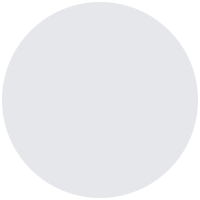

# Hi, I'm Md Solaiman 👋

**Full-Stack Developer** · **WebDGallery** · Bangladesh

12+ years building scalable, high-performance web apps for clinics, agencies, and SaaS products.

  
  
  
  
  

<table>
  <tr>
    <td align="center">
      
      <h3>Md S.</h3>
      
<strong>Full-Stack Developer (Laravel/Vue.js/Nuxt) | WordPress Expert</strong>

      

        
        
        
      

      
📍 Dhaka, Bangladesh

      

        
      

    </td>
  </tr>
</table>

  

---

### 🔭 What I work on
- WordPress & client sites (custom themes, forms, Core Web Vitals / PageSpeed)
- SaaS & multi-tenant products (dashboards, auth, messaging-style platforms)
- Front-end systems with Vue / Nuxt and React / Next.js
- Integrations: APIs, payments, VPS hosting, analytics

### 🌱 Currently improving
- Performance (Core Web Vitals) and clean UI systems for client products
- SaaS architecture for multi-tenant apps

### 💬 Ask me about
`WordPress` · `WooCommerce` · `Elementor` · `ACF` · `Gutenberg` · `Gravity Forms` · `Laravel` · `Vue` / `Nuxt.js` · `Next.js` · `TypeScript` · `PHP` · `React Native` · `Flutter` · `iOS` · `Android` · `JWT` · `Google login` · `2FA` · `Webhooks` · `Cookie consent` · `On-page SEO` · `AI GEO` · `Schema / structured data` · page speed · staging → production workflows

---

### 🛠️ Languages & tools

  

  
  
  
  
  
  
  
  
  
  
  
  
  
  
  
  
  
  
  
  
  
  
  
  
  
  
  
  
  
  
  
  

---

### 📊 GitHub stats

  
   
  

---

### 🤝 How I like to work
Clear requirements → staging first → measurable performance → handoff the client can maintain.

Open to interesting full-stack and WordPress performance projects.

---

### 📫 Connect / hire me

| | |
|:--|:--|
| **Email (projects)** | [nirjondipo@gmail.com](mailto:nirjondipo@gmail.com) |
| **Upwork** | [Hire me on Upwork](https://www.upwork.com/freelancers/~01da2982e531013221) |
| **GitHub** | [github.com/nirjondipo](https://github.com/nirjondipo) |
| **Company** | WebDGallery |
| **Location** | Bangladesh |
